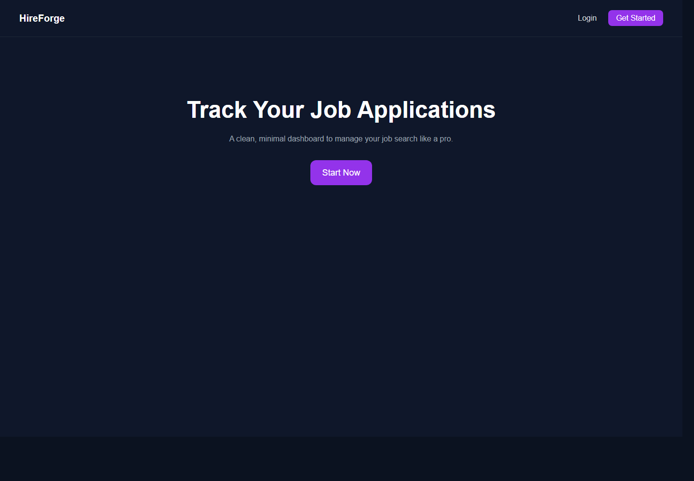
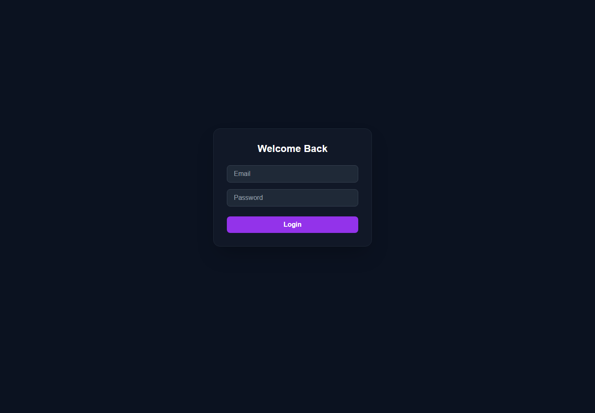
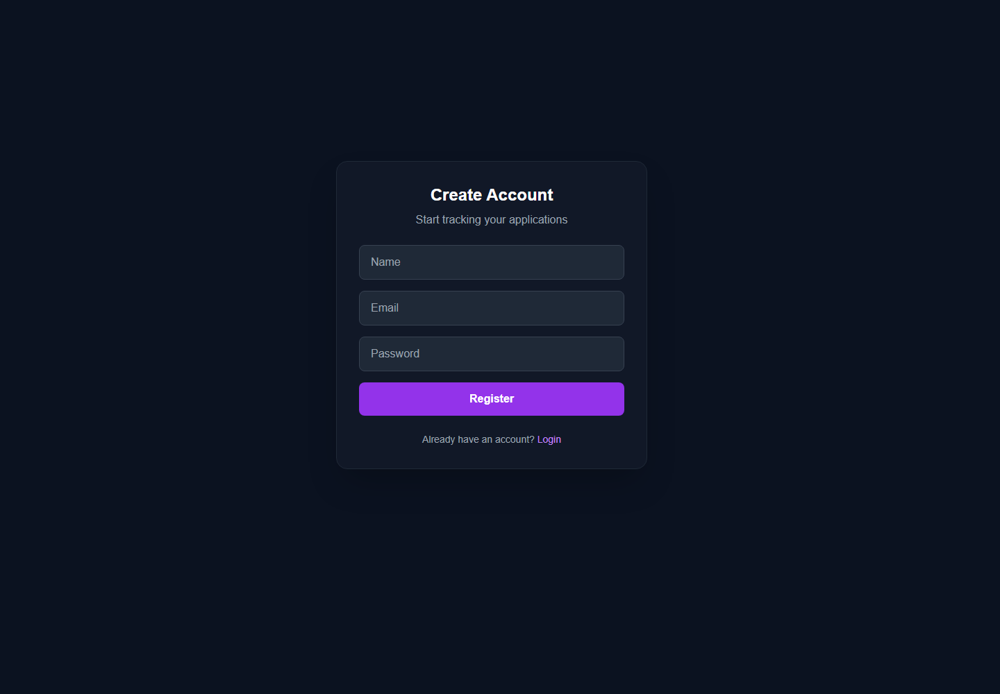

# HireForge Frontend

HireForge is a job application tracking dashboard built with React and Vite. The frontend provides authentication screens, a protected dashboard, application management, and analytics views backed by the HireForge Spring Boot API.

Live demo: https://hireforge-frontend.vercel.app/

## Screenshots

### Home


### Login


### Register


## Features

- User registration and login with JWT-based session storage
- Protected dashboard routes for authenticated users
- Job application list with create, edit, and delete actions
- Application status tracking: Applied, Screening, Interview, Offer, Accepted, Rejected, and Withdrawn
- Analytics view using charts for status distribution
- Axios API client with automatic bearer token headers
- Responsive dark UI built with Tailwind CSS
- Vercel rewrite support for React Router deep links

## Tech Stack

- React 19
- Vite 7
- React Router
- Axios
- Recharts
- Tailwind CSS
- ESLint
- Vercel

## Project Structure

```text
src/
  api/                Axios client and auth service helpers
  components/         Reusable UI such as protected route and modal
  layouts/            Authenticated app layout
  pages/              Home, Login, Register, Dashboard, Applications, Analytics
  main.jsx            React app entry point
  App.jsx             Route definitions
```

## How It Works

The app stores the JWT returned from the backend login endpoint in `localStorage`. Protected pages are wrapped with `ProtectedRoute`, which redirects users without a token back to `/login`.

All authenticated API requests go through `src/api/axios.js`. The Axios request interceptor reads the token and sends it as:

```http
Authorization: Bearer <token>
```

The frontend expects the backend to expose these endpoints:

- `POST /api/auth/register`
- `POST /api/auth/login`
- `GET /api/applications`
- `POST /api/applications`
- `PUT /api/applications/{id}`
- `DELETE /api/applications/{id}`

## Local Setup

1. Install dependencies:

```bash
npm install
```

2. Create or update `.env`:

```env
VITE_API_BASE_URL=http://localhost:8080
```

3. Start the backend from the backend repository.

4. Start the frontend:

```bash
npm run dev
```

5. Open:

```text
http://127.0.0.1:5173
```

## Available Scripts

```bash
npm run dev      # Start local development server
npm run build    # Create production build
npm run lint     # Run ESLint
npm run preview  # Preview production build locally
```

## Deployment Notes

For Vercel, set this environment variable in the Vercel project settings:

```env
VITE_API_BASE_URL=<your deployed backend URL>
```

The included `vercel.json` rewrites all routes to `/`, which allows React Router pages such as `/login`, `/register`, and `/dashboard` to work after refresh.

## Troubleshooting

- Blank page after refreshing a route: confirm `vercel.json` is deployed with the React Router rewrite.
- API calls failing locally: confirm the backend is running on `http://localhost:8080` and `.env` has the correct `VITE_API_BASE_URL`.
- Login succeeds but protected pages fail: clear old tokens from browser storage and log in again.
- Production API errors: confirm the Vercel environment variable points to the deployed backend URL.

## Development Approach

This frontend was built as the client layer for a full-stack job tracking system. The flow started with route setup and authentication, then moved into protected dashboard screens, application CRUD operations, analytics, and deployment configuration. The API layer was centralized through Axios so all backend calls use the same base URL and token behavior.

## Related Repository

- Backend API: `hireforge-backend`
